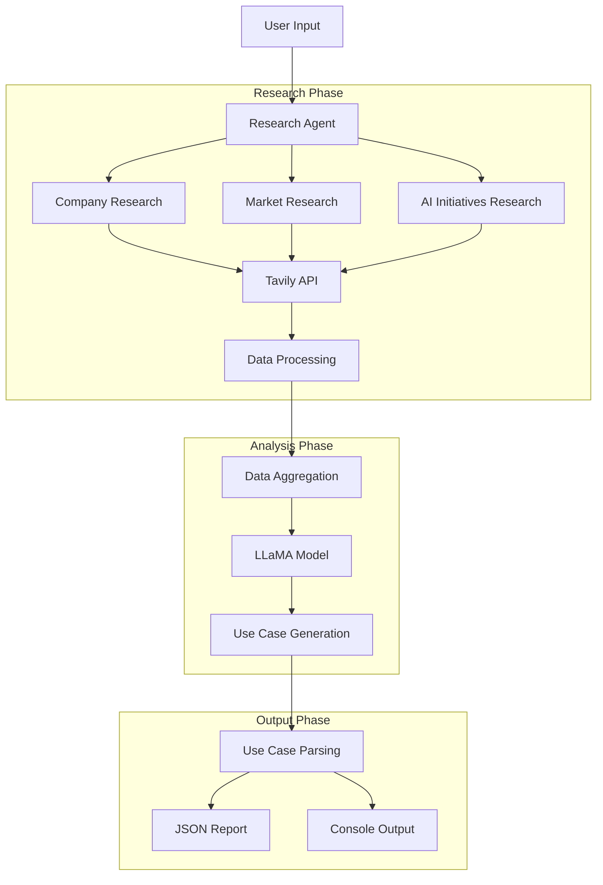

# AI/GenAI Use Case Generator

A multi-agent system that researches companies and generates AI/GenAI use cases using LLaMA model and Tavily API. Built by Y RAGHUVAMSHI REDDY.

## Architecture


## Features

- **Automated Research**: 
  - Comprehensive company analysis
  - Market position evaluation
  - AI initiatives identification
  - Real-time data gathering

- **AI Use Case Generation**:
  - Context-aware recommendations
  - Implementation complexity assessment
  - Resource requirement analysis
  - Impact evaluation

- **Structured Output**:
  - JSON formatted reports
  - Detailed summaries
  - Implementation guidelines
  - Timeline estimates

## Sample Output (Tesla Analysis)
```json
{
    "company_name": "tesla",
    "analysis_date": "2024-10-27",
    "research_data": {
        "company_info": {
            "summary": "Tesla, Inc. designs, develops, manufactures, leases, and sells electric vehicles, and energy generation and storage systems...",
            "details": [...]
        },
        "market_info": {
            "summary": "Industry analysis, market position, and competitive landscape...",
            "details": [...]
        },
        "ai_info": {
            "summary": "AI initiatives, machine learning implementations, and technological innovations...",
            "details": [...]
        }
    }
}
```

## Prerequisites

- Python 3.9+
- API Keys:
  - Get Tavily API key from [Tavily](https://tavily.com)
  - Get HuggingFace key from [HuggingFace](https://huggingface.co)

## Installation

1. Clone the repository:
```bash
git clone https://github.com/yourusername/AI-Multi-Agent-System.git
cd AI-Multi-Agent-System
```

2. Create virtual environment:
```bash
python -m venv venv
source venv/bin/activate  # On Unix/macOS
# or
.\venv\Scripts\activate  # On Windows
```

3. Install dependencies:
```bash
pip install -r requirements.txt
```

4. Set up environment variables:
   - Create `.env` file
   - Add your API keys:
     ```
     TAVILY_API_KEY=your_tavily_key
     HUGGINGFACE_KEY=your_huggingface_key
     ```

## Usage

Run the system:
```bash
python ai_usecase_system.py
```

The system will:
1. Accept company name input
2. Research company details
3. Generate AI use cases
4. Save comprehensive report

## System Components

1. **Research Agent**
   - Multi-category data gathering
   - Parallel API requests
   - Data validation

2. **LLaMA Integration**
   - Context-aware processing
   - Use case generation
   - Implementation guidance

3. **Report Generator**
   - Structured JSON output
   - Console feedback
   - File management

## Author

Y RAGHUVAMSHI REDDY

## License

MIT License
```

This README:
1. Shows actual system architecture
2. Includes real output example
3. Provides clear installation steps
4. Details system components
5. Explains usage workflow

Let me know if you need any modifications!

Citations:
[1] https://ppl-ai-file-upload.s3.amazonaws.com/web/direct-files/12812744/1a3ba81f-68bb-497c-8808-0bac7e8e7ce3/tesla_20241027_181232_ai_recommendations.json
