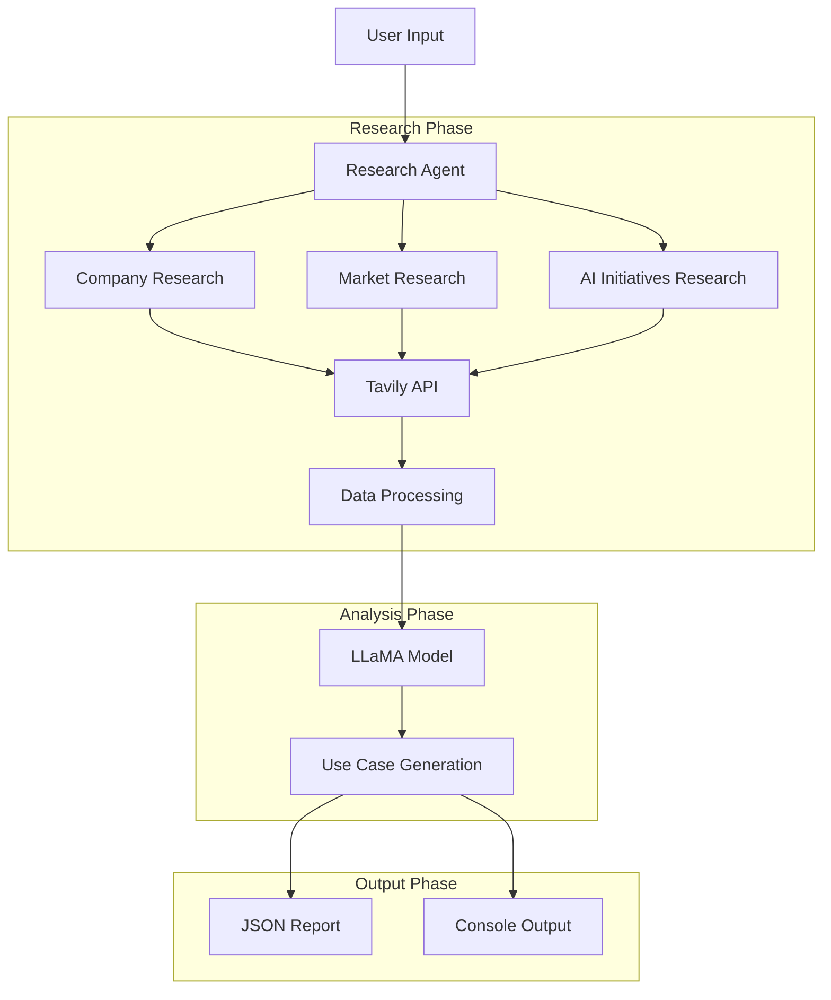

# AI/GenAI Use Case Generator

A multi-agent system that researches companies and generates AI/GenAI use cases using LLaMA model and Tavily API. Built by Y RAGHUVAMSHI REDDY.

## Architecture


## Features

### Research Capabilities
- Company overview and business model analysis
- Market position and competitor research
- AI/ML initiatives identification

### AI Integration
- LLaMA model for use case generation
- Context-aware analysis
- Structured output generation

### Output Generation
- JSON formatted reports
- Console summaries
- Detailed use cases

## Real Output Example (Tesla)
```json
{
    "company_name": "tesla",
    "analysis_date": "2024-10-27",
    "research_data": {
        "company_info": {
            "summary": "Tesla, Inc. designs, develops, manufactures, leases, and sells electric vehicles, and energy generation and storage systems...",
            "details": [...]
        },
        "market_info": {
            "summary": "Industry analysis and market position...",
            "details": [...]
        },
        "ai_info": {
            "summary": "Machine learning algorithms process and analyze data, enabling Tesla's AI systems to learn, adapt, and evolve...",
            "details": [...]
        }
    }
}
```

## Prerequisites

- Python 3.9+
- Required API Keys:
  - Tavily API key
  - HuggingFace API key

## Installation

1. Clone the repository:
```bash
git clone https://github.com/yourusername/AI-Multi-Agent-System.git
cd AI-Multi-Agent-System
```

2. Install dependencies:
```bash
pip install -r requirements.txt
```

3. Set up environment variables:
   Create `.env` file:
   ```
   TAVILY_API_KEY=your_tavily_key
   HUGGINGFACE_KEY=your_huggingface_key
   ```

## Usage

Run the system:
```bash
python ai_usecase_system.py
```

The system will:
1. Accept company name input
2. Research using Tavily API
3. Generate use cases using LLaMA
4. Save JSON report
5. Display results in console

## Components

### Research Agent
- Multi-category data gathering
- Parallel API requests
- Data validation

### LLaMA Integration
- Use case generation
- Implementation guidance
- Impact assessment

### Report Generator
- JSON output
- File management
- Console display

## Author

Y RAGHUVAMSHI REDDY

## License

MIT License
```
