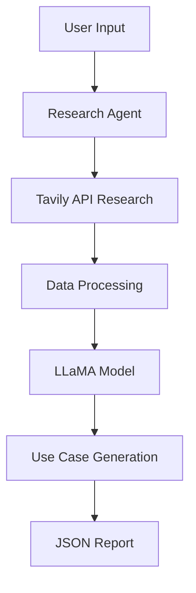

```markdown
# AI/GenAI Use Case Generator

A multi-agent system that researches companies and generates AI/GenAI use cases using LLaMA model and Tavily API. Developed by Y RAGHUVAMSHI REDDY.

## Architecture


## Features

- **Automated Research**: Uses Tavily API for comprehensive company analysis
- **AI Use Case Generation**: LLaMA-powered context-aware use case generation
- **Structured Output**: Detailed JSON reports with research findings
- **Error Handling**: Comprehensive error management
- **Optimized Performance**: Fast processing with parallel requests

## Prerequisites

- Python 3.9+
- API Keys (instructions below)

## Installation

1. Clone the repository:
```bash
git clone https://github.com/yourusername/AI-Multi-Agent-System.git
cd AI-Multi-Agent-System
```

2. Install dependencies:
```bash
pip install langchain-community huggingface_hub requests
```

3. Set up API Keys:
   - Visit [Tavily](https://tavily.com) to get your API key
   - Sign up at [HuggingFace](https://huggingface.co) for access token
   - Add keys to the script or environment variables

## Usage

Run the system:
```bash
python ai_usecase_system1.py
```

Example interaction:
```
Enter company name (or 'quit' to exit): Tesla

Researching Tesla...
Generating AI use cases...

Report saved: reports/tesla_20241027_181232_ai_recommendations.json
```

## Output Format

The system generates structured JSON reports:
```json
{
    "company_name": "company",
    "analysis_date": "2024-10-27",
    "research_data": {
        "company_info": {
            "summary": "Company overview...",
            "details": [...]
        },
        "market_info": {...},
        "ai_info": {...}
    },
    "ai_use_cases": [...]
}
```

## System Components

### Research Agent
- Company information gathering
- Market analysis
- AI initiatives research
- Parallel data processing

### LLaMA Integration
- Model initialization
- Context-aware prompting
- Use case generation
- Response parsing

### Report Generator
- JSON formatting
- File management
- Error handling
- Data validation

## Performance Optimizations

- Reduced token generation
- Optimized context window
- Parallel API requests
- Efficient data extraction
- Quick summary generation

## Error Handling

The system includes error handling for:
- API connection failures
- Model initialization issues
- Data processing errors
- File operations
- Invalid inputs

## Limitations

- Requires active internet connection
- API rate limits apply
- Processing time varies with input size
- Model loading requires sufficient memory

## Future Improvements

- Add more data sources
- Implement caching
- Add visualization tools
- Enhance error recovery
- Improve use case parsing

## Contributing

1. Fork the repository
2. Create your feature branch
3. Commit your changes
4. Push to the branch
5. Create a Pull Request

## License

MIT License

## Author

Y RAGHUVAMSHI REDDY

## Acknowledgments

- LangChain Community
- Tavily API
- HuggingFace
- LLaMA Model
```

This README provides:
1. Clear project overview
2. Installation steps
3. API key setup instructions
4. Usage examples
5. System architecture
6. Component details
7. Future improvements
